# ПОЯСНИТЕЛЬНАЯ ЗАПИСКА

## Система учёта производственных задач

---

## 1. ВВЕДЕНИЕ

В современном мире эффективное управление производственными задачами является критически важным аспектом успешной работы любой организации. Ручное управление задачами, распределение ресурсов и отслеживание прогресса выполнения становятся неэффективными при росте масштабов деятельности предприятия.

Данная работа посвящена разработке RESTful API для системы учёта производственных задач, которая обеспечивает автоматизированное управление контингентом сотрудников предприятия, их распределение по подразделениям и учёт производственных задач.

Система разработана с использованием современных технологий веб-разработки и следует принципам REST архитектуры, обеспечивая масштабируемость, надёжность и безопасность.

---

## 2. АНАЛИТИЧЕСКАЯ ЧАСТЬ

### 2.1. Общее описание проекта

#### Назначение сервиса

Система учёта производственных задач представляет собой веб-сервис, предназначенный для автоматизации процессов управления задачами в организации. Сервис обеспечивает:

- Управление пользователями и их аутентификацию
- Управление информацией о сотрудниках организации
- Управление структурой подразделений
- Создание, назначение и отслеживание производственных задач
- Контроль статусов выполнения задач
- Комментирование задач для улучшения коммуникации между участниками

#### Ключевые сценарии использования

**Сценарий 1: Регистрация и аутентификация пользователя**
- Новый пользователь регистрируется в системе через эндпоинт `/api/v1/accounts/sign_up`
- Пользователь получает доступ к системе после успешной аутентификации через `/api/v1/auth/login`
- Система возвращает JWT токен для последующих запросов

**Сценарий 2: Управление сотрудниками (Администратор)**
- Администратор создаёт нового сотрудника через `/api/v1/employees` (POST)
- Система валидирует данные сотрудника (паспорт, ИНН, СНИЛС)
- Администратор может просматривать список всех сотрудников с пагинацией
- Администратор может обновлять и удалять записи о сотрудниках

**Сценарий 3: Управление подразделениями**
- Администратор создаёт новое подразделение через `/api/v1/departments` (POST)
- Все авторизованные пользователи могут просматривать список подразделений
- Администратор может обновлять и удалять подразделения

**Сценарий 4: Создание и управление задачами**
- Руководитель отдела или администратор создаёт задачу через `/api/v1/tasks` (POST)
- Задача назначается конкретному исполнителю и привязывается к подразделению
- Исполнитель может изменять статус задачи через `/api/v1/tasks/{id}/status` (PATCH)
- Участники задачи могут добавлять комментарии через `/api/v1/tasks/{id}/comments` (POST)

**Сценарий 5: Просмотр задач**
- Руководители отделов и администраторы могут просматривать все задачи, сгруппированные по подразделениям
- Сотрудники могут просматривать задачи своего подразделения
- Каждый пользователь может просматривать свои собственные задачи (назначенные и созданные)

#### Основные функции

1. **Управление пользователями**
   - Регистрация новых пользователей
   - Аутентификация через JWT токены
   - Обновление токенов доступа
   - Управление ролями пользователей

2. **Управление сотрудниками**
   - CRUD операции над записями сотрудников
   - Валидация персональных данных (паспорт, ИНН, СНИЛС)
   - Привязка сотрудников к подразделениям
   - Управление статусом активности сотрудников

3. **Управление подразделениями**
   - CRUD операции над подразделениями
   - Просмотр списка подразделений с пагинацией

4. **Управление задачами**
   - Создание задач с указанием приоритета, сроков, исполнителя
   - Отслеживание статусов выполнения (К выполнению, В работе, На проверке, Выполнено)
   - Группировка задач по подразделениям
   - Комментирование задач
   - Фильтрация задач по подразделению и пользователю

5. **Безопасность и авторизация**
   - Ролевая модель доступа (Администратор, Руководитель отдела, Сотрудник)
   - JWT-аутентификация
   - Контроль доступа к операциям на основе ролей

#### Диаграмма прецедентов

Диаграмма прецедентов показывает взаимодействие актеров (Администратор, Руководитель отдела, Сотрудник) с системой через различные прецеденты использования.

**Актеры:**
- **Администратор** — имеет полный доступ ко всем функциям системы
- **Руководитель отдела** — управляет задачами своего подразделения
- **Сотрудник** — работает со своими задачами и задачами подразделения

**Основные прецеденты:**
- Аутентификация и авторизация (регистрация, вход, обновление токена)
- Управление пользователями (только для администратора)
- Управление сотрудниками (CRUD операции)
- Управление подразделениями (CRUD операции)
- Управление задачами (создание, просмотр, обновление, удаление, изменение статуса, комментирование)

**Визуализация диаграммы прецедентов:**

```mermaid
graph TB
    subgraph System["Система учёта производственных задач"]
        direction TB
        
        subgraph Auth["Аутентификация и авторизация"]
            RegisterUser["Регистрация пользователя"]
            Login["Вход в систему"]
            RefreshToken["Обновление токена"]
        end
        
        subgraph Users["Управление пользователями"]
            RegisterUserByAdmin["Регистрация пользователя администратором"]
            ViewUsersList["Просмотр списка пользователей"]
        end
        
        subgraph Employees["Управление сотрудниками"]
            ViewEmployeesList["Просмотр списка сотрудников"]
            ViewEmployeeDetails["Просмотр данных сотрудника"]
            CreateEmployee["Создание сотрудника"]
            UpdateEmployee["Обновление данных сотрудника"]
            DeleteEmployee["Удаление сотрудника"]
        end
        
        subgraph Departments["Управление подразделениями"]
            ViewDepartmentsList["Просмотр списка подразделений"]
            ViewDepartmentDetails["Просмотр данных подразделения"]
            CreateDepartment["Создание подразделения"]
            UpdateDepartment["Обновление подразделения"]
            DeleteDepartment["Удаление подразделения"]
        end
        
        subgraph Tasks["Управление задачами"]
            ViewAllTasksGrouped["Просмотр всех задач<br/>по подразделениям"]
            ViewDepartmentTasks["Просмотр задач подразделения"]
            ViewMyTasks["Просмотр своих задач"]
            CreateTask["Создание задачи"]
            UpdateTask["Обновление задачи"]
            DeleteTask["Удаление задачи"]
            UpdateTaskStatus["Изменение статуса задачи"]
            AddTaskComment["Добавление комментария к задаче"]
        end
    end
    
    Admin["👤 Администратор"]
    Manager["👤 Руководитель отдела"]
    Employee["👤 Сотрудник"]
    
    Admin --> RegisterUser
    Admin --> Login
    Admin --> RefreshToken
    Admin --> RegisterUserByAdmin
    Admin --> ViewUsersList
    Admin --> ViewEmployeesList
    Admin --> ViewEmployeeDetails
    Admin --> CreateEmployee
    Admin --> UpdateEmployee
    Admin --> DeleteEmployee
    Admin --> ViewDepartmentsList
    Admin --> ViewDepartmentDetails
    Admin --> CreateDepartment
    Admin --> UpdateDepartment
    Admin --> DeleteDepartment
    Admin --> ViewAllTasksGrouped
    Admin --> ViewDepartmentTasks
    Admin --> ViewMyTasks
    Admin --> CreateTask
    Admin --> UpdateTask
    Admin --> DeleteTask
    Admin --> UpdateTaskStatus
    Admin --> AddTaskComment
    
    Manager --> Login
    Manager --> RefreshToken
    Manager --> ViewDepartmentsList
    Manager --> ViewDepartmentDetails
    Manager --> ViewAllTasksGrouped
    Manager --> ViewDepartmentTasks
    Manager --> ViewMyTasks
    Manager --> CreateTask
    Manager --> UpdateTask
    Manager --> DeleteTask
    Manager --> UpdateTaskStatus
    Manager --> AddTaskComment
    
    Employee --> Login
    Employee --> RefreshToken
    Employee --> ViewDepartmentsList
    Employee --> ViewDepartmentDetails
    Employee --> ViewDepartmentTasks
    Employee --> ViewMyTasks
    Employee --> UpdateTaskStatus
    Employee --> AddTaskComment
    Employee -.->|"только свои данные"| UpdateEmployee
    
    style Admin fill:#ff6b6b
    style Manager fill:#4ecdc4
    style Employee fill:#95e1d3
    style System fill:#f0f0f0
    style RegisterUserByAdmin fill:#ffe66d
    style ViewUsersList fill:#ffe66d
    style ViewEmployeesList fill:#ffe66d
    style ViewEmployeeDetails fill:#ffe66d
    style CreateEmployee fill:#ffe66d
    style UpdateEmployee fill:#ffe66d
    style DeleteEmployee fill:#ffe66d
    style CreateDepartment fill:#ffe66d
    style UpdateDepartment fill:#ffe66d
    style DeleteDepartment fill:#ffe66d
    style ViewAllTasksGrouped fill:#ffe66d
    style CreateTask fill:#ffe66d
    style UpdateTask fill:#ffe66d
    style DeleteTask fill:#ffe66d
```



**Файлы с диаграммами в формате UML:**
- `use_case_diagram.puml` — диаграмма в формате PlantUML (для визуализации в PlantUML редакторах)
- `use_case_diagram.mmd` — диаграмма в формате Mermaid (для встраивания в Markdown)

Для визуализации PlantUML диаграммы можно использовать:
- Онлайн редактор: http://www.plantuml.com/plantuml/uml/
- Плагины для IDE (IntelliJ IDEA, VS Code)
- Локальные инструменты: PlantUML, Graphviz

Для визуализации Mermaid диаграммы можно использовать:
- Онлайн редактор: https://mermaid.live/
- Плагины для Markdown редакторов
- GitHub/GitLab (поддерживают Mermaid нативно)

### 2.2. Технологический стек

#### Используемые платформы

- **Python 3.13+** — язык программирования
- **PostgreSQL** — реляционная система управления базами данных
- **Uvicorn** — ASGI сервер для запуска FastAPI приложений

#### База данных

- **PostgreSQL 12+** — выбран в качестве основной СУБД по следующим причинам:
  - Надёжность и стабильность
  - Поддержка транзакций ACID
  - Богатые возможности для работы с реляционными данными
  - Высокая производительность при работе с большими объёмами данных
  - Поддержка внешних ключей и ограничений целостности

#### Библиотеки и фреймворки

**Веб-фреймворк:**
- **FastAPI 0.121.0** — современный высокопроизводительный веб-фреймворк для создания API
  - Автоматическая генерация документации (Swagger/OpenAPI)
  - Встроенная валидация данных через Pydantic
  - Асинхронная поддержка
  - Типизация данных

**ORM и работа с БД:**
- **SQLModel 0.0.27** — ORM на основе SQLAlchemy и Pydantic
  - Объединение моделей SQLAlchemy и схем Pydantic
  - Типобезопасность
  - Автоматическая генерация схем API
- **SQLAlchemy 2.0.44** — мощный инструментарий SQL для Python
- **psycopg2 2.9.11** — адаптер PostgreSQL для Python
- **Alembic 1.17.2** — инструмент миграций базы данных

**Безопасность:**
- **python-jose 3.5.0** — библиотека для работы с JWT токенами
- **argon2-cffi 25.1.0** — современный алгоритм хеширования паролей
  - Устойчивость к атакам перебора
  - Адаптивное хеширование

**Утилиты:**
- **fastapi-pagination 0.15.0** — библиотека для пагинации результатов
- **python-dotenv 1.2.1** — загрузка переменных окружения из .env файлов
- **python-multipart 0.0.20** — поддержка multipart форм для FastAPI
- **Faker 24.4.0** — генерация тестовых данных (для разработки)

**Сервер:**
- **Uvicorn 0.38.0** — ASGI сервер на основе uvloop и httptools

### 2.3. Архитектура приложения

#### Описание слоёв приложения

Приложение построено по многослойной архитектуре (Layered Architecture), которая обеспечивает разделение ответственности и упрощает поддержку кода:

**1. Слой представления (Presentation Layer)**
- **Расположение:** `app/api/v1/`
- **Назначение:** Определение HTTP эндпоинтов, маршрутизация запросов
- **Компоненты:**
  - `api_users_router.py` — маршруты для работы с пользователями
  - `api_employee_router.py` — маршруты для работы с сотрудниками
  - `api_departments_router.py` — маршруты для работы с подразделениями
  - `api_tasks_router.py` — маршруты для работы с задачами

**2. Слой бизнес-логики (Business Logic Layer)**
- **Расположение:** `app/controllers/`
- **Назначение:** Реализация бизнес-логики приложения
- **Компоненты:**
  - `users_controller.py` — логика аутентификации и управления пользователями
  - `employee_controller.py` — логика управления сотрудниками
  - `departments_controller.py` — логика управления подразделениями
  - `tasks_controller.py` — логика управления задачами

**3. Слой доступа к данным (Data Access Layer)**
- **Расположение:** `app/models/` и `app/db/`
- **Назначение:** Определение моделей данных и работа с базой данных
- **Компоненты:**
  - `models/` — SQLModel модели данных
  - `db/database.py` — подключение к БД и инициализация
  - `db/session.py` — управление сессиями БД

**4. Слой валидации (Validation Layer)**
- **Расположение:** `app/schemas/`
- **Назначение:** Определение схем валидации входных и выходных данных
- **Компоненты:**
  - `user_schema.py` — схемы для пользователей
  - `employee_schema.py` — схемы для сотрудников
  - `departments_schema.py` — схемы для подразделений
  - `task_schema.py` — схемы для задач

**5. Слой безопасности (Security Layer)**
- **Расположение:** `app/core/security.py`
- **Назначение:** Аутентификация, авторизация, работа с JWT токенами
- **Функции:**
  - Генерация и валидация JWT токенов
  - Проверка прав доступа на основе ролей
  - Хеширование паролей

**6. Точка входа (Entry Point)**
- **Расположение:** `app/main.py`
- **Назначение:** Инициализация приложения, подключение роутеров, настройка жизненного цикла

#### Модели данных

**Users (Пользователи)**
- `id` (int, PK) — уникальный идентификатор
- `username` (str, unique) — имя пользователя
- `password` (str) — хеш пароля (Argon2)
- `role_id` (int, FK → Roles.id) — идентификатор роли
- Связи: один-к-одному с Employees, один-ко-многим с Tasks (созданные и назначенные), один-ко-многим с TaskComments

**Employees (Сотрудники)**
- `id` (int, PK) — уникальный идентификатор
- `user_id` (int, FK → Users.id, nullable) — связь с пользователем
- `first_name` (str) — имя
- `last_name` (str) — фамилия
- `middle_name` (str, nullable) — отчество
- `phone_number` (str, nullable) — номер телефона
- `email` (str, unique) — электронная почта
- `passport_data` (str, unique, min_length=10) — паспортные данные
- `inn` (str, nullable, unique, min_length=12) — ИНН
- `snils` (str, nullable, unique, min_length=11) — СНИЛС
- `department_id` (int, FK → Departments.id) — подразделение
- `is_active` (bool) — статус активности
- `created_at` (datetime) — дата создания
- `updated_at` (datetime) — дата обновления

**Departments (Подразделения)**
- `id` (int, PK) — уникальный идентификатор
- `name` (str) — название подразделения
- `description` (str, nullable) — описание
- `created_at` (datetime) — дата создания
- Связи: один-ко-многим с Employees, один-ко-многим с Tasks

**Tasks (Задачи)**
- `id` (int, PK) — уникальный идентификатор
- `title` (str) — заголовок задачи
- `description` (str) — описание задачи
- `creator_id` (int, FK → Users.id) — создатель задачи
- `assignee_id` (int, FK → Users.id) — исполнитель задачи
- `department_id` (int, FK → Departments.id) — подразделение
- `status_id` (int, FK → Task_Status.id) — статус задачи
- `priority` (str, default="малый") — приоритет задачи
- `planned_start_date` (date, nullable) — запланированная дата начала
- `planned_end_date` (date, nullable) — запланированная дата окончания
- `actual_start_date` (date, nullable) — фактическая дата начала
- `actual_end_date` (date, nullable) — фактическая дата окончания
- `created_at` (datetime) — дата создания
- `updated_at` (datetime) — дата обновления
- Связи: многие-к-одному с Users (creator, assignee), Departments, Task_Status; один-ко-многим с TaskComments

**Task_Status (Статусы задач)**
- `id` (int, PK) — уникальный идентификатор
- `name` (str) — название статуса ("К выполнению", "В работе", "На проверке", "Выполнено")
- `order_index` (int) — порядок сортировки
- Связи: один-ко-многим с Tasks

**TaskComments (Комментарии к задачам)**
- `id` (int, PK) — уникальный идентификатор
- `task_id` (int, FK → Tasks.id) — задача
- `author_id` (int, FK → Users.id) — автор комментария
- `comment_text` (str) — текст комментария
- `created_at` (datetime) — дата создания
- Связи: многие-к-одному с Tasks, Users

**Roles (Роли)**
- `id` (int, PK) — уникальный идентификатор
- `name` (str, unique) — название роли
- `description` (str) — описание роли
- Связи: один-ко-многим с Users

#### Диаграмма классов

```
┌─────────────────────────────────────────────────────────────┐
│                        Users                                 │
├─────────────────────────────────────────────────────────────┤
│ + id: int (PK)                                              │
│ + username: str (unique)                                    │
│ + password: str                                             │
│ + role_id: int (FK)                                         │
├─────────────────────────────────────────────────────────────┤
│ + employees: List[Employees]                                 │
│ + created_tasks: List[Tasks]                                │
│ + assigned_tasks: List[Tasks]                               │
│ + comments: List[TaskComments]                              │
│ + role: Roles                                               │
└─────────────────────────────────────────────────────────────┘
                            │
                            │ 1
                            │
                            │ *
┌─────────────────────────────────────────────────────────────┐
│                      Employees                                │
├─────────────────────────────────────────────────────────────┤
│ + id: int (PK)                                              │
│ + user_id: int (FK, nullable)                               │
│ + first_name: str                                           │
│ + last_name: str                                            │
│ + middle_name: str (nullable)                               │
│ + phone_number: str (nullable)                              │
│ + email: str (unique)                                       │
│ + passport_data: str (unique)                               │
│ + inn: str (nullable, unique)                                │
│ + snils: str (nullable, unique)                              │
│ + department_id: int (FK)                                   │
│ + is_active: bool                                           │
│ + created_at: datetime                                      │
│ + updated_at: datetime                                      │
├─────────────────────────────────────────────────────────────┤
│ + department: Departments                                   │
│ + user: Users (nullable)                                    │
└─────────────────────────────────────────────────────────────┘
                            │
                            │ *
                            │
                            │ 1
┌─────────────────────────────────────────────────────────────┐
│                    Departments                               │
├─────────────────────────────────────────────────────────────┤
│ + id: int (PK)                                              │
│ + name: str                                                 │
│ + description: str (nullable)                               │
│ + created_at: datetime                                      │
├─────────────────────────────────────────────────────────────┤
│ + employees: List[Employees]                                 │
│ + tasks: List[Tasks]                                        │
└─────────────────────────────────────────────────────────────┘
                            │
                            │ 1
                            │
                            │ *
┌─────────────────────────────────────────────────────────────┐
│                        Tasks                                  │
├─────────────────────────────────────────────────────────────┤
│ + id: int (PK)                                              │
│ + title: str                                                │
│ + description: str                                          │
│ + creator_id: int (FK)                                      │
│ + assignee_id: int (FK)                                     │
│ + department_id: int (FK)                                   │
│ + status_id: int (FK)                                       │
│ + priority: str                                             │
│ + planned_start_date: date (nullable)                       │
│ + planned_end_date: date (nullable)                         │
│ + actual_start_date: date (nullable)                        │
│ + actual_end_date: date (nullable)                           │
│ + created_at: datetime                                      │
│ + updated_at: datetime                                      │
├─────────────────────────────────────────────────────────────┤
│ + creator: Users                                            │
│ + assignee: Users                                           │
│ + department: Departments                                   │
│ + status: Task_Status                                       │
│ + comments: List[TaskComments]                             │
└─────────────────────────────────────────────────────────────┘
                            │
                            │ *
                            │
                            │ 1
┌─────────────────────────────────────────────────────────────┐
│                    Task_Status                               │
├─────────────────────────────────────────────────────────────┤
│ + id: int (PK)                                              │
│ + name: str                                                 │
│ + order_index: int                                          │
├─────────────────────────────────────────────────────────────┤
│ + tasks: List[Tasks]                                         │
└─────────────────────────────────────────────────────────────┘

┌─────────────────────────────────────────────────────────────┐
│                    TaskComments                              │
├─────────────────────────────────────────────────────────────┤
│ + id: int (PK)                                              │
│ + task_id: int (FK)                                         │
│ + author_id: int (FK)                                       │
│ + comment_text: str                                         │
│ + created_at: datetime                                      │
├─────────────────────────────────────────────────────────────┤
│ + task: Tasks                                               │
│ + author: Users                                             │
└─────────────────────────────────────────────────────────────┘

┌─────────────────────────────────────────────────────────────┐
│                        Roles                                  │
├─────────────────────────────────────────────────────────────┤
│ + id: int (PK)                                              │
│ + name: str (unique)                                        │
│ + description: str                                           │
├─────────────────────────────────────────────────────────────┤
│ + user_role: List[Users]                                    │
└─────────────────────────────────────────────────────────────┘
```

#### Структура приложения

```
count_tasks_kursovaya/
├── app/
│   ├── api/                          # Слой представления
│   │   └── v1/
│   │       ├── api_departments_router.py
│   │       ├── api_employee_router.py
│   │       ├── api_tasks_router.py
│   │       └── api_users_router.py
│   ├── controllers/                   # Слой бизнес-логики
│   │   ├── departments_controller.py
│   │   ├── employee_controller.py
│   │   ├── tasks_controller.py
│   │   └── users_controller.py
│   ├── core/                         # Общие утилиты
│   │   └── security.py               # Безопасность, JWT, авторизация
│   ├── db/                           # Слой доступа к данным
│   │   ├── database.py               # Подключение к БД
│   │   └── session.py                # Управление сессиями
│   ├── models/                       # Модели данных (SQLModel)
│   │   ├── __init__.py
│   │   ├── departments_model.py
│   │   ├── employee_models.py
│   │   ├── roles.py
│   │   ├── task_comments.py
│   │   ├── task_status.py
│   │   ├── tasks.py
│   │   └── users.py
│   ├── schemas/                      # Схемы валидации (Pydantic)
│   │   ├── departments_schema.py
│   │   ├── employee_schema.py
│   │   ├── task_schema.py
│   │   └── user_schema.py
│   └── main.py                       # Точка входа приложения
├── alembic/                          # Миграции БД
├── venv/                             # Виртуальное окружение
├── requirements.txt                  # Зависимости проекта
├── README.md                         # Документация
└── .env                              # Переменные окружения (не в репозитории)
```

### 2.4. Безопасность

#### Механизмы аутентификации

**1. JWT (JSON Web Tokens) аутентификация**

Система использует JWT токены для аутентификации пользователей. Процесс аутентификации:

1. **Регистрация пользователя:**
   - Пользователь отправляет POST запрос на `/api/v1/accounts/sign_up` с username и password
   - Пароль хешируется с использованием Argon2
   - Создаётся запись пользователя в базе данных с ролью по умолчанию (role_id = 1 для обычных пользователей)

2. **Вход в систему:**
   - Пользователь отправляет POST запрос на `/api/v1/auth/login` с username и password
   - Система проверяет username в базе данных
   - Проверяется соответствие пароля с использованием `argon2.verify()`
   - При успешной проверке генерируется JWT токен с помощью функции `create_access_token()`
   - Токен содержит поле `sub` (subject) с username пользователя
   - Токен имеет срок действия, определяемый переменной окружения `ACCESS_TOKEN_EXPIRE_MINUTES` (по умолчанию 30 минут)

3. **Использование токена:**
   - Клиент отправляет токен в заголовке `Authorization: Bearer <token>`
   - Система извлекает токен через `OAuth2PasswordBearer` схему
   - Токен декодируется и валидируется функцией `decode_token()`
   - Из токена извлекается username, по которому находится пользователь в БД

**2. Хеширование паролей**

- **Алгоритм:** Argon2 (через библиотеку `argon2-cffi`)
- **Преимущества:**
  - Устойчивость к атакам перебора (brute-force)
  - Адаптивное хеширование (защита от атак с использованием GPU/ASIC)
  - Современный и безопасный алгоритм
- **Реализация:** Пароли никогда не хранятся в открытом виде, только хеши

**3. Обновление токенов**

- Эндпоинт `/api/v1/auth/refresh` позволяет обновить access токен
- Принимает refresh токен (который является обычным access токеном)
- Проверяет валидность токена и генерирует новый access токен

#### Механизмы авторизации

**1. Ролевая модель доступа (RBAC)**

Система использует ролевую модель доступа с тремя основными ролями:

- **Администратор (role_id = 1):**
  - Полный доступ ко всем функциям системы
  - Управление пользователями, сотрудниками, подразделениями, задачами
  - Может создавать пользователей с любыми ролями
  - Может изменять статус активности сотрудников

- **Руководитель отдела (role_id = 2):**
  - Просмотр всех задач, сгруппированных по подразделениям
  - Создание, изменение и удаление задач
  - Изменение статусов задач
  - Комментирование задач
  - Просмотр задач своего подразделения

- **Сотрудник (role_id > 2):**
  - Просмотр своих задач (назначенных и созданных)
  - Просмотр задач своего подразделения
  - Изменение статуса своих задач
  - Комментирование задач, к которым имеет доступ
  - Обновление своих личных данных (с ограничениями)

**2. Функции проверки прав доступа**

- **`get_current_user()`** — извлекает текущего пользователя из JWT токена
  - Используется как зависимость (dependency) в эндпоинтах
  - Вызывает HTTPException 401 при невалидном токене или отсутствии пользователя

- **`admin_required()`** — проверяет, что пользователь является администратором
  - Проверяет `user.role_id == 1`
  - Вызывает HTTPException 403 при отсутствии прав администратора

- **`department_manager_required()`** — проверяет, что пользователь является руководителем отдела или администратором
  - Проверяет `user.role_id == 1 or user.role_id == 2`
  - Вызывает HTTPException 403 при отсутствии необходимых прав

**3. Контроль доступа на уровне данных**

- **Обновление данных сотрудника:**
  - Администратор может изменять любые данные
  - Руководитель отдела может изменять данные сотрудников
  - Сотрудник может изменять только свои данные и не может изменять `user_id`, `department_id`, `is_active`

- **Изменение статуса задачи:**
  - Доступ имеют: создатель задачи, исполнитель задачи, администратор, руководитель отдела
  - Проверка выполняется в контроллере `update_task_status()`

- **Комментирование задач:**
  - Доступ имеют: создатель задачи, исполнитель задачи, администратор, руководитель отдела
  - Проверка выполняется в контроллере `add_comment_to_task()`

**4. Валидация входных данных**

- Использование Pydantic схем для валидации всех входных данных
- Валидация длины полей (паспорт минимум 10 символов, ИНН минимум 12 символов, СНИЛС минимум 11 символов)
- Проверка уникальности данных на уровне БД (email, username, passport_data, inn, snils)

**5. Защита от SQL-инъекций**

- Использование SQLModel/SQLAlchemy ORM предотвращает SQL-инъекции
- Все запросы параметризованы
- Прямые SQL запросы не используются

**6. Переменные окружения**

- Секретные ключи и конфигурация хранятся в файле `.env`
- Файл `.env` не должен попадать в систему контроля версий
- `SECRET_KEY` используется для подписи JWT токенов
- `ALGORITHM` определяет алгоритм подписи (HS256)

---

## 3. ПРОЕКТНАЯ ЧАСТЬ

### 3.1. Описание API

#### Версионирование API

API использует версионирование через префикс пути: `/api/v1/`. Это позволяет в будущем создавать новые версии API без нарушения обратной совместимости.

#### Список всех эндпоинтов с HTTP-методами

##### Аутентификация и пользователи (`/api/v1`)

| Метод | Endpoint | Описание | Требует авторизации | Роль |
|-------|----------|----------|---------------------|------|
| POST | `/accounts/sign_up` | Регистрация нового пользователя | Нет | - |
| POST | `/accounts/sign_up_as_admin` | Регистрация пользователя администратором | Да | Администратор |
| POST | `/auth/login` | Вход в систему, получение JWT токена | Нет | - |
| POST | `/auth/refresh` | Обновление access токена | Нет | - |
| GET | `/users` | Получить список всех пользователей | Да | Администратор |

##### Сотрудники (`/api/v1/employees`)

| Метод | Endpoint | Описание | Требует авторизации | Роль |
|-------|----------|----------|---------------------|------|
| GET | `/employees` | Получить список всех сотрудников (с пагинацией) | Да | Администратор |
| GET | `/employees/{id}` | Получить сотрудника по ID | Да | Администратор |
| POST | `/employees` | Создать нового сотрудника | Да | Администратор |
| PUT | `/employees/{id}` | Обновить данные сотрудника | Да | Администратор/Менеджер/Сам сотрудник |
| DELETE | `/employees/{id}` | Удалить сотрудника | Да | Администратор |

##### Подразделения (`/api/v1/departments`)

| Метод | Endpoint | Описание | Требует авторизации | Роль |
|-------|----------|----------|---------------------|------|
| GET | `/departments` | Получить список всех подразделений (с пагинацией) | Да | Любой авторизованный |
| GET | `/departments/{id}` | Получить подразделение по ID | Да | Любой авторизованный |
| POST | `/departments` | Создать новое подразделение | Да | Администратор |
| PUT | `/departments/{id}` | Обновить данные подразделения | Да | Администратор |
| DELETE | `/departments/{id}` | Удалить подразделение | Да | Администратор |

##### Задачи (`/api/v1/tasks`)

| Метод | Endpoint | Описание | Требует авторизации | Роль |
|-------|----------|----------|---------------------|------|
| GET | `/tasks` | Получить все задачи, сгруппированные по подразделениям | Да | Руководитель/Администратор |
| GET | `/tasks/my-department` | Получить задачи своего подразделения (с пагинацией) | Да | Любой авторизованный |
| GET | `/tasks/my` | Получить свои задачи (назначенные и созданные) (с пагинацией) | Да | Любой авторизованный |
| POST | `/tasks` | Создать новую задачу | Да | Руководитель/Администратор |
| PUT | `/tasks/{id}` | Обновить задачу | Да | Руководитель/Администратор |
| DELETE | `/tasks/{id}` | Удалить задачу | Да | Руководитель/Администратор |
| PATCH | `/tasks/{task_id}/status` | Изменить статус задачи | Да | Создатель/Исполнитель/Руководитель/Администратор |
| POST | `/tasks/{task_id}/comments` | Добавить комментарий к задаче | Да | Создатель/Исполнитель/Руководитель/Администратор |

#### Форматы запросов и ответов

Все запросы и ответы используют формат JSON, за исключением эндпоинтов аутентификации, которые используют `application/x-www-form-urlencoded`.

#### Примеры запросов и ответов

##### 1. Регистрация пользователя

**Вводимые данные:**
- username: admin_user_2024
- password: MySecurePass123!

**Запрос:**
```http
POST /api/v1/accounts/sign_up
Content-Type: application/x-www-form-urlencoded
```

**Тело запроса:**
```
username=admin_user_2024&password=MySecurePass123!
```

**Ответ (200 OK):**
```json
{
  "id": 1,
  "username": "admin_user_2024",
  "password": "$argon2id$v=19$m=65536,t=3,p=4$...",
  "role_id": 1
}
```

##### 2. Вход в систему

**Вводимые данные:**
- username: admin_user_2024
- password: MySecurePass123!

**Запрос:**
```http
POST /api/v1/auth/login
Content-Type: application/x-www-form-urlencoded
```

**Тело запроса:**
```
username=admin_user_2024&password=MySecurePass123!
```

**Ответ (200 OK):**
```json
{
  "access_token": "eyJhbGciOiJIUzI1NiIsInR5cCI6IkpXVCJ9.eyJzdWIiOiJhZG1pbl91c2VyXzIwMjQiLCJleHAiOjE3MDQwNjcyMDB9...",
  "token_type": "bearer"
}
```

##### 3. Получение списка сотрудников

**Параметры запроса:**
- page: 1 (номер страницы)
- size: 10 (количество элементов на странице)

**Ответ (200 OK):**
```json
{
  "items": [
    {
      "id": 1,
      "user_id": 1,
      "first_name": "Иван",
      "last_name": "Иванов",
      "middle_name": "Иванович",
      "phone_number": "+79001234567",
      "email": "ivan.ivanov@example.com",
      "passport_data": "1234567890",
      "inn": "123456789012",
      "snils": "12345678901",
      "department_id": 1,
      "is_active": true,
      "created_at": "2024-01-15T10:30:00Z",
      "updated_at": "2024-01-15T10:30:00Z"
    }
  ],
  "total": 50,
  "page": 1,
  "size": 10,
  "pages": 5
}
```

##### 4. Создание сотрудника

**Вводимые данные:**
- user_id: 1
- first_name: "Петр"
- last_name: "Петров"
- middle_name: "Петрович"
- phone_number: "+79009876543"
- email: "petr.petrov@company.ru"
- passport_data: "4510123456"
- inn: "123456789012"
- snils: "12345678901"
- department_id: 1
- is_active: true

**Тело запроса (JSON):**
```json
{
  "user_id": 1,
  "first_name": "Петр",
  "last_name": "Петров",
  "middle_name": "Петрович",
  "phone_number": "+79009876543",
  "email": "petr.petrov@company.ru",
  "passport_data": "4510123456",
  "inn": "123456789012",
  "snils": "12345678901",
  "department_id": 1,
  "is_active": true
}
```

**Ответ (200 OK):**
```json
{
  "id": 2,
  "user_id": 1,
  "first_name": "Петр",
  "last_name": "Петров",
  "middle_name": "Петрович",
  "phone_number": "+79009876543",
      "email": "petr.petrov@company.ru",
      "passport_data": "4510123456",
  "inn": "987654321098",
  "snils": "98765432109",
  "department_id": 1,
  "is_active": true,
  "created_at": "2024-01-15T11:00:00Z",
  "updated_at": "2024-01-15T11:00:00Z"
}
```

##### 5. Создание подразделения

**Вводимые данные:**
- name: "Отдел разработки"
- description: "Отдел занимается разработкой программного обеспечения"

**Тело запроса (JSON):**
```json
{
  "name": "Отдел разработки",
  "description": "Отдел занимается разработкой программного обеспечения"
}
```

**Ответ (200 OK):**
```json
{
  "id": 1,
  "name": "Отдел разработки",
  "description": "Отдел занимается разработкой программного обеспечения",
  "created_at": "2024-01-15T10:00:00Z"
}
```

##### 6. Получение задач, сгруппированных по подразделениям

**Ответ (200 OK):**
```json
{
  "departments": [
    {
      "department_id": 1,
      "department_name": "Отдел разработки",
      "tasks": [
        {
          "id": 1,
          "title": "Разработать API для задач",
          "description": "Создать REST API для управления задачами",
          "creator_id": 1,
          "assignee_id": 2,
          "department_id": 1,
          "status_id": 2,
          "priority": "высокий",
          "planned_start_date": "2024-01-20",
          "planned_end_date": "2024-02-15",
          "actual_start_date": "2024-01-20",
          "actual_end_date": null,
          "created_at": "2024-01-15T10:00:00Z",
          "updated_at": "2024-01-20T09:00:00Z"
        }
      ]
    }
  ]
}
```

##### 7. Создание задачи

**Вводимые данные:**
- title: "Обновить документацию"
- description: "Обновить документацию API согласно новым требованиям"
- creator_id: 1
- assignee_id: 2
- department_id: 1
- status_id: 1
- priority: "средний"
- planned_start_date: "2024-02-01"
- planned_end_date: "2024-02-28"

**Тело запроса (JSON):**
```json
{
  "title": "Обновить документацию",
  "description": "Обновить документацию API согласно новым требованиям",
  "creator_id": 1,
  "assignee_id": 2,
  "department_id": 1,
  "status_id": 1,
  "priority": "средний",
  "planned_start_date": "2024-02-01",
  "planned_end_date": "2024-02-28"
}
```

**Ответ (200 OK):**
```json
{
  "id": 2,
  "title": "Обновить документацию",
  "description": "Обновить документацию API согласно новым требованиям",
  "creator_id": 1,
  "assignee_id": 2,
  "department_id": 1,
  "status_id": 1,
  "priority": "средний",
  "planned_start_date": "2024-02-01",
  "planned_end_date": "2024-02-28",
  "actual_start_date": null,
  "actual_end_date": null,
  "created_at": "2024-01-15T12:00:00Z",
  "updated_at": "2024-01-15T12:00:00Z"
}
```

##### 8. Изменение статуса задачи

**Вводимые данные:**
- task_id (в URL): 1
- status_name: "В работе"

**Доступные значения status_name:**
- "К выполнению"
- "В работе"
- "На проверке"
- "Выполнено"

**Тело запроса (JSON):**
```json
{
  "status_name": "В работе"
}
```

**Ответ (200 OK):**
```json
{
  "id": 1,
  "title": "Разработать API для задач",
  "description": "Создать REST API для управления задачами",
  "creator_id": 1,
  "assignee_id": 2,
  "department_id": 1,
  "status_id": 2,
  "priority": "высокий",
  "planned_start_date": "2024-01-20",
  "planned_end_date": "2024-02-15",
  "actual_start_date": "2024-01-20",
  "actual_end_date": null,
  "created_at": "2024-01-15T10:00:00Z",
  "updated_at": "2024-01-20T10:30:00Z"
}
```

##### 9. Добавление комментария к задаче

**Вводимые данные:**
- task_id (в URL): 1
- comment_text: "Начал работу над задачей. Ожидаю завершения к концу недели."

**Тело запроса (JSON):**
```json
{
  "comment_text": "Начал работу над задачей. Ожидаю завершения к концу недели."
}
```

**Ответ (200 OK):**
```json
{
  "id": 1,
  "task_id": 1,
  "author_id": 2,
  "comment_text": "Начал работу над задачей. Ожидаю завершения к концу недели.",
  "created_at": "2024-01-20T10:35:00Z"
}
```

#### Описание параметров

##### Параметры пути (Path Parameters)

- **`/employees/{id}`** — `id` (int, required): ID сотрудника
- **`/departments/{id}`** — `id` (int, required): ID подразделения
- **`/tasks/{id}`** — `id` (int, required): ID задачи
- **`/tasks/{task_id}/status`** — `task_id` (int, required): ID задачи
- **`/tasks/{task_id}/comments`** — `task_id` (int, required): ID задачи

##### Параметры запроса (Query Parameters)

- **Пагинация:**
  - `page` (int, optional, default=1): Номер страницы
  - `size` (int, optional, default=10): Количество элементов на странице

Пример: `/api/v1/employees?page=2&size=20`

##### Параметры тела запроса (Request Body)

**EmployeeCreate:**
```json
{
  "user_id": 1,                    // int, optional
  "first_name": "Иван",            // string, required
  "last_name": "Иванов",           // string, required
  "middle_name": "Иванович",       // string, optional
  "phone_number": "+79001234567",  // string, optional
  "email": "ivan@example.com",     // string, required, unique
  "passport_data": "1234567890",   // string, required, unique, min_length=10
  "inn": "123456789012",           // string, optional, unique, min_length=12
  "snils": "12345678901",          // string, optional, unique, min_length=11
  "department_id": 1,              // int, required
  "is_active": true                // bool, optional, default=true
}
```

**TaskCreate:**
```json
{
  "title": "Название задачи",      // string, required
  "description": "Описание",        // string, required
  "creator_id": 1,                 // int, required
  "assignee_id": 2,                // int, required
  "department_id": 1,              // int, required
  "status_id": 1,                  // int, required
  "priority": "малый",             // string, optional, default="малый"
  "planned_start_date": "2024-02-01", // date, optional, format: YYYY-MM-DD
  "planned_end_date": "2024-02-28",  // date, optional, format: YYYY-MM-DD
  "actual_start_date": null,       // date, optional
  "actual_end_date": null          // date, optional
}
```

**TaskStatusUpdate:**
```json
{
  "status_name": "В работе"        // string, required, значения: "К выполнению", "В работе", "На проверке", "Выполнено"
}
```

**TaskCommentCreate:**
```json
{
  "comment_text": "Текст комментария"  // string, required
}
```

#### Коды ответов, ошибки, сообщения

##### Успешные ответы

- **200 OK** — запрос выполнен успешно
- **201 Created** — ресурс успешно создан (не используется в текущей реализации, все операции возвращают 200)

##### Ошибки клиента (4xx)

- **400 Bad Request** — неверный формат запроса или нарушение валидации
  ```json
  {
    "detail": "Ошибка: дубликат или нарушение целостности данных"
  }
  ```
  Или:
  ```json
  {
    "detail": [
      {
        "loc": ["body", "passport_data"],
        "msg": "Паспортные данные должны содержать не менее 10 символов",
        "type": "value_error"
      }
    ]
  }
  ```

- **401 Unauthorized** — отсутствует или невалидный токен аутентификации
  ```json
  {
    "detail": "Невалидный токен"
  }
  ```
  Или:
  ```json
  {
    "detail": "Неверный логин или пароль"
  }
  ```

- **403 Forbidden** — недостаточно прав для выполнения операции
  ```json
  {
    "detail": "Требуются права администратора"
  }
  ```
  Или:
  ```json
  {
    "detail": "У вас нет доступа к изменению статуса этой задачи"
  }
  ```

- **404 Not Found** — ресурс не найден
  ```json
  {
    "detail": "идентификатор не найден"
  }
  ```
  Или:
  ```json
  {
    "detail": "Задача не найдена"
  }
  ```

##### Ошибки сервера (5xx)

- **500 Internal Server Error** — внутренняя ошибка сервера
  ```json
  {
    "detail": "Внутренняя ошибка сервера: <описание ошибки>"
  }
  ```

#### Пагинация, фильтрация, сортировка

##### Пагинация

Система использует библиотеку `fastapi-pagination` для реализации пагинации. Пагинация применяется к следующим эндпоинтам:

- `GET /api/v1/employees` — список сотрудников
- `GET /api/v1/departments` — список подразделений
- `GET /api/v1/users` — список пользователей
- `GET /api/v1/tasks/my-department` — задачи подразделения
- `GET /api/v1/tasks/my` — личные задачи пользователя

**Параметры пагинации:**
- `page` (int, optional, default=1): Номер страницы (начиная с 1)
- `size` (int, optional, default=10): Количество элементов на странице

**Формат ответа с пагинацией:**
```json
{
  "items": [...],      // Массив элементов текущей страницы
  "total": 100,        // Общее количество элементов
  "page": 1,           // Текущая страница
  "size": 10,          // Размер страницы
  "pages": 10          // Общее количество страниц
}
```

**Пример запроса:**
```http
GET /api/v1/employees?page=2&size=20
Authorization: Bearer <token>
```

##### Фильтрация

В текущей версии API явная фильтрация через query параметры не реализована. Фильтрация выполняется на уровне бизнес-логики:

- `GET /api/v1/tasks/my-department` — возвращает только задачи подразделения текущего пользователя
- `GET /api/v1/tasks/my` — возвращает только задачи текущего пользователя (назначенные и созданные)

##### Сортировка

Сортировка реализована на уровне контроллеров:

- Задачи сортируются по `department_id`, затем по `id`
- Подразделения и сотрудники сортируются по `id` (порядок вставки)

В будущих версиях API можно добавить параметр `sort` для указания поля и направления сортировки.

#### Безопасность API

##### Аутентификация

Все защищённые эндпоинты требуют JWT токен в заголовке `Authorization`:

```http
Authorization: Bearer <access_token>
```

Токен получается через эндпоинт `/api/v1/auth/login` и имеет ограниченный срок действия.

##### Авторизация

Проверка прав доступа выполняется через зависимости FastAPI:

- `Depends(get_current_user)` — требует любой валидный токен
- `Depends(admin_required)` — требует роль администратора
- `Depends(department_manager_required)` — требует роль руководителя отдела или администратора

##### Описание токенов

**JWT Access Token структура:**
```json
{
  "sub": "username",           // Subject (имя пользователя)
  "exp": 1704067200,          // Expiration time (Unix timestamp)
  "iat": 1704063600           // Issued at (необязательно)
}
```

**Алгоритм подписи:** HS256 (HMAC-SHA256)

**Секретный ключ:** Хранится в переменной окружения `SECRET_KEY`

**Время жизни токена:** Определяется переменной окружения `ACCESS_TOKEN_EXPIRE_MINUTES` (по умолчанию 30 минут)

**Обновление токена:**
- Токен можно обновить через эндпоинт `/api/v1/auth/refresh`
- Передаётся текущий access токен как refresh токен
- Система проверяет валидность и выдаёт новый access токен

### 3.2. Развертывание приложения

#### Предварительные требования

1. **Python 3.13 или выше**
2. **PostgreSQL 12 или выше**
3. **pip** (менеджер пакетов Python)
4. **Git** (опционально, для клонирования репозитория)

#### Пошаговая инструкция по развертыванию

**Шаг 1: Установка PostgreSQL**

1. Скачайте и установите PostgreSQL с официального сайта: https://www.postgresql.org/download/
2. Создайте базу данных:
   ```sql
   CREATE DATABASE task_management;
   ```
3. Создайте пользователя базы данных (опционально):
   ```sql
   CREATE USER task_user WITH PASSWORD 'your_password';
   GRANT ALL PRIVILEGES ON DATABASE task_management TO task_user;
   ```

**Шаг 2: Клонирование репозитория (если используется Git)**

```bash
git clone <repository-url>
cd count_tasks_kursovaya
```

**Шаг 3: Создание виртуального окружения**

```bash
python -m venv venv
```

**Шаг 4: Активация виртуального окружения**

Windows:
```bash
venv\Scripts\activate
```

Linux/Mac:
```bash
source venv/bin/activate
```

**Шаг 5: Установка зависимостей**

```bash
pip install -r requirements.txt
```

**Шаг 6: Настройка переменных окружения**

Создайте файл `.env` в корне проекта:

```env
# Настройки базы данных
DB_USER=task_user
DB_PASSWORD=your_password
DB_HOST=localhost
DB_PORT=5432
DB_NAME=task_management

# Настройки безопасности
SECRET_KEY=your-secret-key-here-minimum-32-characters-long-random-string
ALGORITHM=HS256
ACCESS_TOKEN_EXPIRE_MINUTES=30
```

**Важно:** 
- `SECRET_KEY` должен быть длиной минимум 32 символа
- Используйте сильный случайный ключ в продакшене
- Не коммитьте файл `.env` в систему контроля версий

**Шаг 7: Инициализация базы данных**

База данных инициализируется автоматически при первом запуске приложения через функцию `init_db()` в `app/db/database.py`. Таблицы создаются автоматически на основе SQLModel моделей.

**Шаг 8: Запуск приложения**

Для разработки (с автоперезагрузкой):
```bash
uvicorn app.main:app_v1 --reload --host 0.0.0.0 --port 8000
```

Для продакшена (рекомендуется использовать процесс-менеджер, например systemd или supervisor):
```bash
uvicorn app.main:app_v1 --host 0.0.0.0 --port 8000 --workers 4
```

**Шаг 9: Проверка работы приложения**

1. Откройте в браузере документацию Swagger: http://localhost:8000/docs
2. Или альтернативную документацию ReDoc: http://localhost:8000/redoc
3. Проверьте доступность API через любой HTTP клиент

#### Развертывание в продакшене

**Рекомендации для продакшена:**

1. **Использование reverse proxy (Nginx):**
   ```nginx
   server {
       listen 80;
       server_name api.example.com;
       
       location / {
           proxy_pass http://127.0.0.1:8000;
           proxy_set_header Host $host;
           proxy_set_header X-Real-IP $remote_addr;
       }
   }
   ```

2. **HTTPS через Let's Encrypt:**
   - Используйте SSL/TLS сертификаты для защиты передачи данных
   - Настройте автоматическое обновление сертификатов

3. **Процесс-менеджер (systemd):**
   Создайте файл `/etc/systemd/system/task-api.service`:
   ```ini
   [Unit]
   Description=Task Management API
   After=network.target

   [Service]
   User=www-data
   WorkingDirectory=/path/to/count_tasks_kursovaya
   Environment="PATH=/path/to/venv/bin"
   ExecStart=/path/to/venv/bin/uvicorn app.main:app_v1 --host 0.0.0.0 --port 8000 --workers 4
   Restart=always

   [Install]
   WantedBy=multi-user.target
   ```

4. **Мониторинг и логирование:**
   - Настройте централизованное логирование
   - Используйте инструменты мониторинга (Prometheus, Grafana)
   - Настройте алерты при ошибках

5. **Резервное копирование базы данных:**
   - Настройте регулярное резервное копирование PostgreSQL
   - Храните резервные копии в безопасном месте

6. **Безопасность:**
   - Ограничьте доступ к серверу через firewall
   - Используйте сильные пароли для базы данных
   - Регулярно обновляйте зависимости
   - Настройте rate limiting для защиты от DDoS атак

#### Миграции базы данных

Проект использует Alembic для управления миграциями базы данных. Миграции находятся в директории `alembic/versions/`.

**Применение миграций:**
```bash
alembic upgrade head
```

**Создание новой миграции:**
```bash
alembic revision --autogenerate -m "описание изменений"
```

---

## 4. ЗАКЛЮЧЕНИЕ

В рамках данной работы была разработана система учёта производственных задач, представляющая собой RESTful API на базе современного веб-фреймворка FastAPI. Система обеспечивает полный цикл управления задачами в организации: от регистрации пользователей и управления сотрудниками до создания, назначения и отслеживания производственных задач.

**Основные достижения проекта:**

1. **Архитектура:** Применена многослойная архитектура, обеспечивающая разделение ответственности и упрощающая поддержку и расширение системы.

2. **Безопасность:** Реализована надёжная система аутентификации на основе JWT токенов и ролевая модель доступа, обеспечивающая контроль доступа к ресурсам на основе ролей пользователей.

3. **Масштабируемость:** Использование пагинации, эффективных запросов к базе данных и асинхронной архитектуры FastAPI обеспечивает возможность работы с большими объёмами данных.

4. **Валидация данных:** Применение Pydantic схем обеспечивает строгую валидацию входных данных и предотвращает ошибки на ранних этапах обработки запросов.

5. **Документация:** Автоматическая генерация документации API через Swagger/OpenAPI упрощает интеграцию и использование системы.

6. **Типобезопасность:** Использование SQLModel и типизации Python обеспечивает безопасность типов и снижает количество ошибок во время разработки.

**Возможности для дальнейшего развития:**

1. Добавление фильтрации и сортировки через query параметры
2. Реализация полнотекстового поиска по задачам и сотрудникам
3. Добавление системы уведомлений (email, push)
4. Реализация экспорта данных в различные форматы (Excel, PDF)
5. Добавление аналитики и отчётов
6. Реализация WebSocket для real-time обновлений
7. Добавление системы файловых вложений к задачам
8. Расширение системы ролей и прав доступа

Система готова к использованию и может быть развёрнута в производственной среде с соблюдением рекомендаций по безопасности и производительности.

---

## 5. ПРИЛОЖЕНИЯ

### Приложение А: Swagger/Redoc документация

После запуска приложения документация API доступна по следующим адресам:

- **Swagger UI:** http://localhost:8000/docs
- **ReDoc:** http://localhost:8000/redoc
- **OpenAPI JSON:** http://localhost:8000/openapi.json

Документация генерируется автоматически на основе определений эндпоинтов и схем данных. Она включает:

- Описание всех эндпоинтов
- Параметры запросов и ответов
- Примеры запросов и ответов
- Возможность тестирования API прямо из браузера
- Описание схем данных (моделей)

### Приложение Б: Примеры использования API

#### Пример работы с API через cURL

**1. Регистрация пользователя:**
```bash
curl -X POST "http://localhost:8000/api/v1/accounts/sign_up" \
  -H "Content-Type: application/x-www-form-urlencoded" \
  -d "username=test_user&password=test_password123"
```

**2. Вход в систему:**
```bash
curl -X POST "http://localhost:8000/api/v1/auth/login" \
  -H "Content-Type: application/x-www-form-urlencoded" \
  -d "username=test_user&password=test_password123"
```

**3. Получение списка сотрудников:**
```bash
curl -X GET "http://localhost:8000/api/v1/employees?page=1&size=10" \
  -H "Authorization: Bearer YOUR_ACCESS_TOKEN"
```

**4. Создание задачи:**
```bash
curl -X POST "http://localhost:8000/api/v1/tasks" \
  -H "Authorization: Bearer YOUR_ACCESS_TOKEN" \
  -H "Content-Type: application/json" \
  -d '{
    "title": "Новая задача",
    "description": "Описание задачи",
    "creator_id": 1,
    "assignee_id": 2,
    "department_id": 1,
    "status_id": 1,
    "priority": "высокий"
  }'
```

#### Пример работы с API через Python (requests)

```python
import requests

BASE_URL = "http://localhost:8000/api/v1"

# Регистрация
response = requests.post(
    f"{BASE_URL}/accounts/sign_up",
    data={"username": "test_user", "password": "test_password123"}
)
print(response.json())

# Вход
response = requests.post(
    f"{BASE_URL}/auth/login",
    data={"username": "test_user", "password": "test_password123"}
)
token = response.json()["access_token"]
headers = {"Authorization": f"Bearer {token}"}

# Получение задач
response = requests.get(f"{BASE_URL}/tasks/my", headers=headers)
print(response.json())
```

---

**Дата создания:** 2024  
**Версия документа:** 1.0  
**Версия API:** 1.0.0

